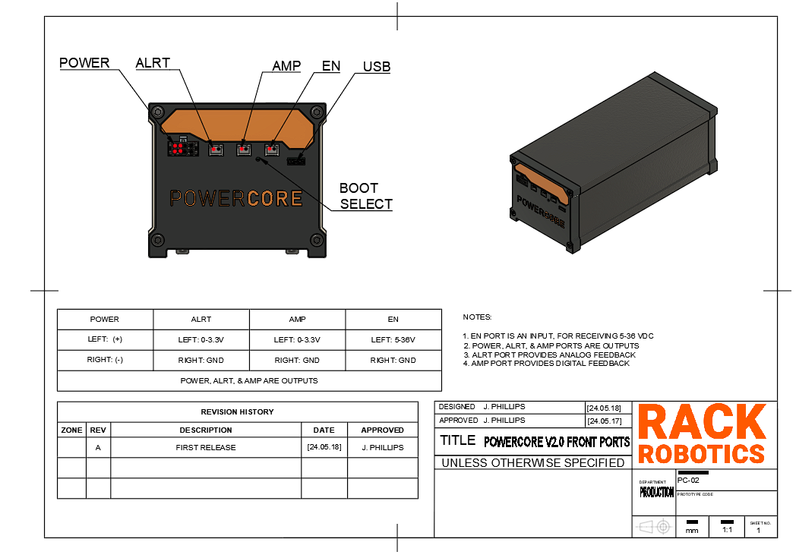

# Powercore V2.0 User Manual

## What is the Powercore V2.0? 

The Powercore V2.0 is an open-source wire EDM (electrical discharge machining) power supply developed by Rack Robotics. It aims to provide a cost-effective and easily replicable solution for wire EDM enthusiasts and professionals.

### What is wire EDM? 

Wire Electrical Discharge Machining (Wire EDM) is a manufacturing process used to cut intricate shapes and contours in electrically conductive materials, such as metals. It operates by generating a series of rapid electrical discharges between a thin, electrically charged wire (usually made of brass) and the workpiece, which is submerged in a dielectric fluid (usually water). The electrical discharges create intense localized heat, which melts and vaporizes small portions of the material. This allows for the creation of complex geometries with high accuracy and fine surface finishes

## Before you begin 

### Safety

!!! danger The Powercore V2.0 operates at a potentially hazardous voltage of 65 - 72 VDC, and supplies high-power waveforms

Improper use of the Powercore can increase radiated emission levels. These intrinsic properties of EDM necessitate operator care and supervision. Touching the workpiece or electrode(s) during EDM operation exposes the may expose the user to 65 - 72 VDC high-voltage. Individuals with pacemakers or similar medical devices should not operate the Powercore, as the high-voltage environment could interfere with their functionality. Ensure that proper measures are taken against EMI. Routing of EDM power through unshielded/twisted cables not recommended. Unshielded/twisted cables function as antennas, which will radiate emissions into the nearby environment.

### Help

If you find that there's something unclear in this documentation, please [submit a ticket on Github](https://github.com/Rack-Robotics/docs.git). 

If you have questions, please join our [discord](https://discord.gg/z4XNk7Hkgw). 

## Powercore V2.0 IO Ports

 Port | Description |
| --- | --- |
|**POWER** | The Powercore V2.0 outputs EDM waveforms through an 8-position Molex Micro-Fit 3.0 connector. The included output cable is 1 meter long and rated for 30 cycles. This cable consists of four twisted pairs to significantly reduce electromagnetic emissions. For more information about twisted wires and their benefits, refer to the best practices section.|
|**ALRT** | The Powercore V2.0 provides digital telemetry on the spark ignition rate via the ALRT port. The spark ignition rate, defined as the ratio of 'observed discharges' to 'possible discharges'. The spark ignition rate is a key indicator of feedrate efficiency. A low rate suggests the feedrate can be increased, while a high rate indicates an excessive feedrate or a short circuit. Telemetry is reported as a PWM duty cycle, which can be read by a control board or microcontroller. This port enables closed-loop feedrate control, ensuring optimal material removal. An ignition rate of approximately 80% has been observed to be optimal.|
|**AMP**| The Powercore V2.0 provides analog telemetry via the on-board current sensor (U17A, LMV358AIDGKR, output shunt). It is mapped to between 0V and 3.3V, at a rate of 12 mV/A. This may be used for closed-loop feedback control and debugging. |
|**EN**| The Powercore V2.0 features an "enable port" that ensures safety by requiring activation before the device outputs EDM waveforms. When the Powercore is plugged in, it remains inactive until the enable port receives a DC voltage between **5V and 36V**. This port draws minimal current. The enable port can be connected to GPIO, motor, heater, or LED ports on a 3D printer or CNC control board, or controlled manually with a switch. *To prevent damage*, avoid disconnecting the main AC power while the enable port is active.|
|**USB**| A type-C USB port provides communication with the on-board RP2040 micronctroller and flash memory. Pressing the reset button (the pin-hole located between the ‘AMP’ and ‘EN’ ports) during power-up initiates the USB bootloader mode, allowing access to the flash memory. When the reset button is held down while powering up, the RP2040 enters a special state where it presents itself as a mass storage device to a connected computer. This enables users to drag and drop firmware files directly into the flash memory, facilitating easy updates and modifications without needing additional programming tools or interfaces.|

## Best Practices

- Avoid short circuits. A short circuit occurs when the POWER port outputs short together. This may happen if wiring is incorrect, or the cutting electrode collides with the work. A prolonged short circuit can damage the Powercore.

- When integrating the Powercore V2.0 into a wire EDM build, ensure that the EN port fails to an off default state during machine shutoff.

- Avoid disconnecting main power from the Powercore V2.0 while the device is enabled. 