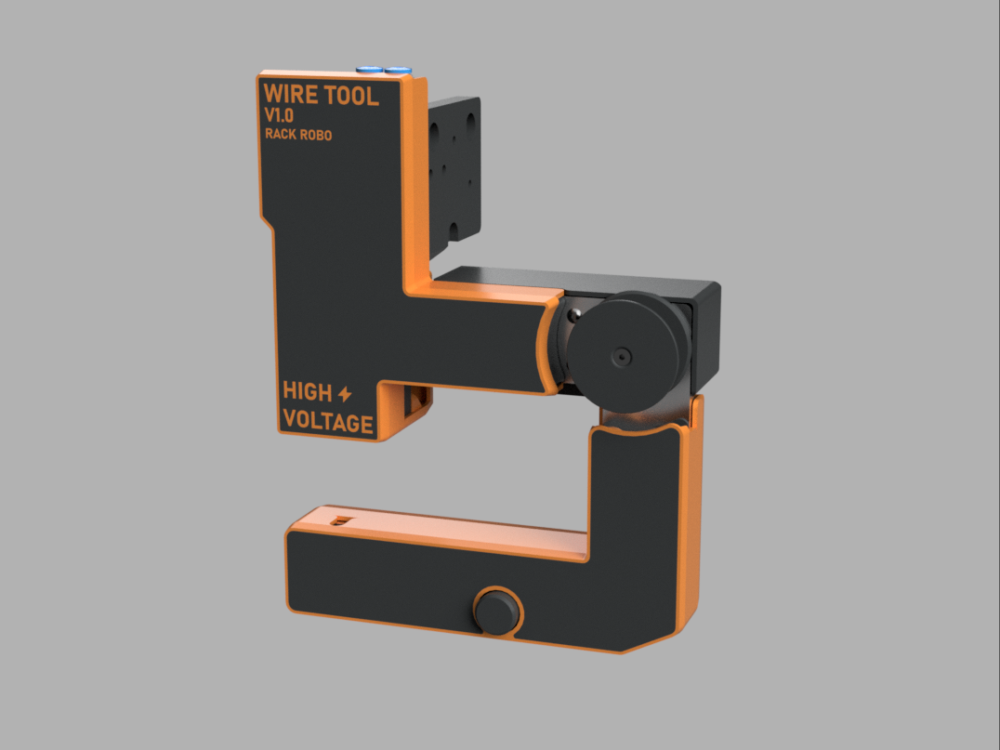

# Wire Tool V1.0 User Manual 

## What is the Wire Tool V1.0? 

The Wire Tool V1.0 is an open-source wire EDM (electrical discharge machining) wire EDM toolhead developed by Rack Robotics. It aims to provide a cost-effective and easily hackable solution for wire EDM enthusiasts and professionals. The Wire Tool V1.0 is designed to be mounted to a CNC motion system of the user's choice.

### Safety

The Wire Tool V2.0 is intended to be used in combination with the Powercore V2.0 EDM power supply. The Powercore V2.0 operates at a potentially hazardous voltage of 65 - 72 VDC, and supplies high-power waveforms. Improper use of the Powercore can increase radiated emission levels. These intrinsic properties of EDM necessitate operator care and supervision. 

Touching the workpiece or electrode(s) during EDM operation exposes the may expose the user to 65 - 72 VDC high-voltage. Individuals with pacemakers or similar medical devices should not operate the Powercore, as the high-voltage environment could interfere with their functionality.

Ensure that proper measures are taken against EMI. Routing of EDM power through unshielded/twisted cables not recommended. Unshielded/twisted cables function as antennas, which will radiate emissions into the nearby environment.

### Help

If you find that there's something unclear in this documentation, please [submit a ticket on Github](https://github.com/Rack-Robotics/docs.git). 

If you have questions, please join our [discord](https://discord.gg/z4XNk7Hkgw). 

## Best_Practices

- Consult the best practices section of the Powercore V2.0 documentation. 
- Avoid collision of the wire with the work. A collision may result in wire breakage, and cut failure. Ensure that the wire tool is rigidly mounted on it's motion platform. Unwanted vibration or movement of the wire tool during operation may result in cut failure or wire breakage.

## Assembly

## Mounting

## Threading of Wire

## Integrating Flushing

## Trouble Shooting

## Contributing to the Wire Tool