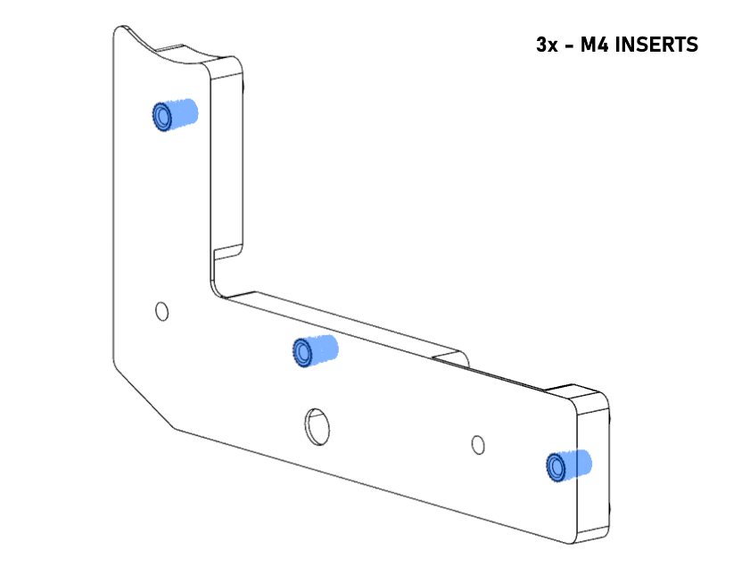
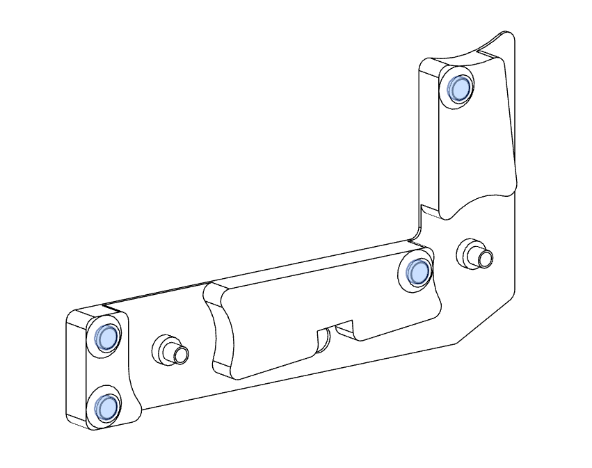
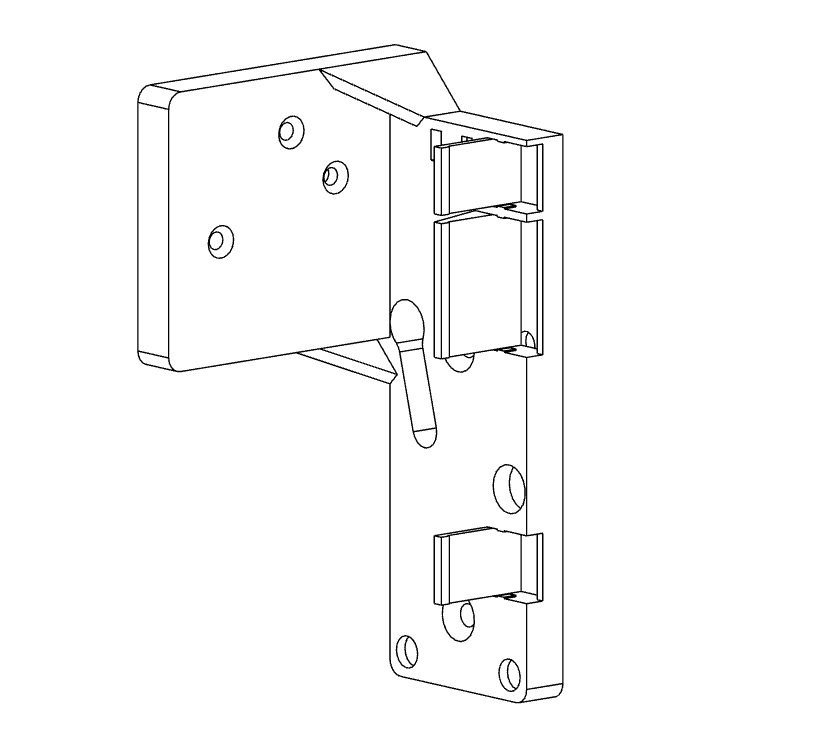
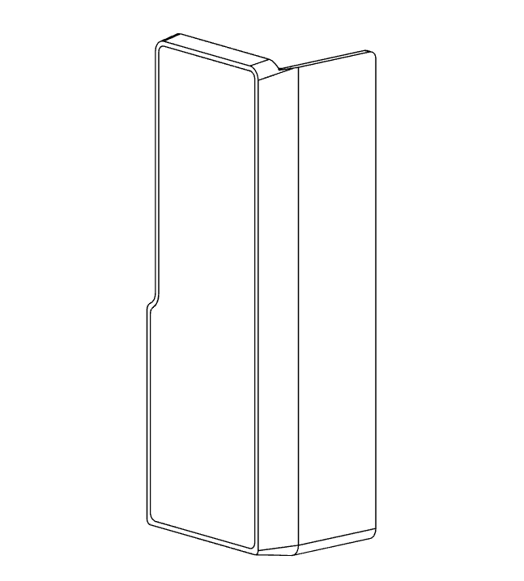
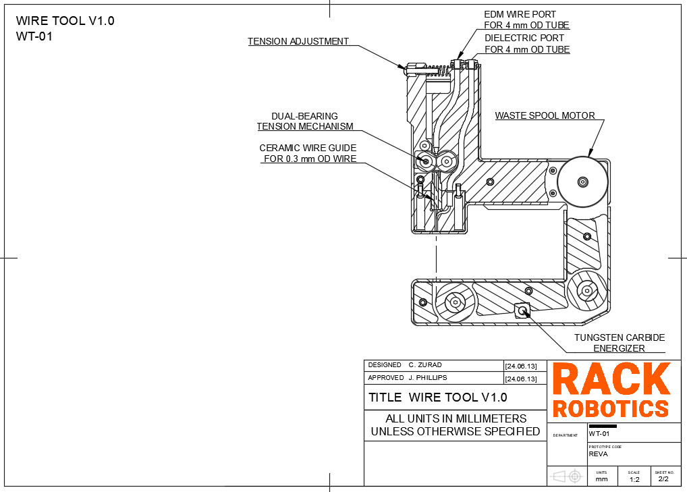

# Wire Tool V1.0 User Manual (UNDER CONSTRUCTION)

## What is the Wire Tool V1.0? 

The Wire Tool V1.0 is an open-source wire EDM (electrical discharge machining) wire EDM toolhead developed by Rack Robotics. It aims to provide a cost-effective and easily hackable solution for wire EDM enthusiasts and professionals. The Wire Tool V1.0 is designed to be mounted to a CNC motion system of the user's choice.

### Safety

**DANGER.** The Powercore operates at a potentially hazardous voltage of 65 - 72 VDC, and supplies high-power waveforms.

The Wire Tool V2.0 is intended to be used in combination with the Powercore V2.0 EDM power supply. Improper use of the Powercore can increase radiated emission levels. These intrinsic properties of EDM necessitate operator care and supervision. Touching the workpiece or electrode(s) during EDM operation exposes the may expose the user to 65 - 72 VDC high-voltage. Individuals with pacemakers or similar medical devices should not operate the Powercore, as the high-voltage environment could interfere with their functionality. Ensure that proper measures are taken against EMI. Routing of EDM power through unshielded/twisted cables not recommended. Unshielded/twisted cables function as antennas, which will radiate emissions into the nearby environment.

### Help

If you find that there's something unclear in this documentation, please [submit a ticket on Github](https://github.com/Rack-Robotics/docs.git). 

If you have questions, please join our [discord](https://discord.gg/z4XNk7Hkgw). 

## Best Practices

- Consult the best practices section of the Powercore V2.0 documentation. 
- Avoid collision of the wire with the work. A collision may result in wire breakage, and cut failure. Ensure that the wire tool is rigidly mounted on it's motion platform. Unwanted vibration or movement of the wire tool during operation may result in cut failure or wire breakage.

## Assembly

The following assembly will cover the base configuration for the WT-01. This base configuration is designed to work with the Ender 3 V1 3D printer. You will need to modify the Tool Mount and Vat to fit your specific machine if you are not using an Ender 3 V1. 

This assembly requires hot glue, super glue, and heat set inserts. Each of these pose their own hazards to health. Take proper safety precautions when assembling the WT-01.

## 3D Prints

All 3D printable files can be found on the [Rack Robotics Printables page](https://www.printables.com/@RackRoboticsO_631255). Files included are 3MF, STL, STEP, and Fusion Archive. You may need to modify files for threaded insert to work with your chosen filament.

For Bambulab users, a ready to print project file has been provided.

### Required Files

|File Name            |Number Required    |Dual Color (Y/N)|Requires Threaded Inserts (Y/N)|
|---------------------|-------------------|----------------|-------------------------------|
|Back Lower Base      |         1         |        N       |N                              |
|Back Lower Cover     |         1         |        Y       |N                              |
|Fastener Cap         |         1         |        N       |N                              |
|Flushing Cap         |         1         |        N       |N                              |
|Front Base Cover     |         1         |        Y       |Y                              |
|Idler                |         2         |        N       |N                              |
|Insulating Boss      |         1         |        N       |N                              |
|Motor Cover          |         1         |        N       |N                              |
|Motor Mount          |         1         |        N       |N                              |
|Pinch Roller Bushing |         1         |        N       |N                              |
|Spool Puller         |         1         |        N       |N                              |
|Tension Arm          |         1         |        N       |Y                              |
|Tensioner Body       |         1         |        N       |Y                              |
|Tensioner Cover      |         1         |        Y       |N                              |
|Tool Mount Ender 3   |         1         |        N       |N                              |
|Tool Mount Cover     |         1         |        Y       |N                              |

## Threaded Insert Installation

Threaded inserts are used in this tool. Please use caution when installing threaded inserts.

Install the threaded inserts in accordance with the following images:

### Front Base

### Tension Arm

### Tensioner Body

## Magnet Installation

Magnets are used to retain safety covers on the WT-01. All magnets provided are M6x2. While magnets should fit snugly into their recesses, a small drop of super glue will prevent the magnets from working their way out after many cycles of installation and removal.

Install magnets in accordance with the following images:

### Front Lower Base

### Back Lower Base

### Tool Mount

### Tensioner Body

### Flushing Cap

### Front Lower Cover

### Back Lower Cover

### Tool Mount Cover

### Tensioner Cover

## Mechanical Assembly

When assembling the WT-01, care must be taken not to cross thread fasteners into the aluminum endoskeleton. If fasteners are cross threaded, the type III anodizing may be damaged, exposing the bare aluminum to water. This will lead to corrosion and premature degradation of your WT-01.

All hardware required for assembly is included with the WT-01 kit from Rack Robotics. Additional 625RS bearings and WC blocks have been provided as these are wear components.

The following hardware is required for assembly of the WT-01:

|Part                                 |Number Required    |
|-------------------------------------|-------------------|
|Endoskeleton                         |         1         |
|Ceramic Wire Guide                   |         1         |
|WC Block                             |         1         |
|625RS Bearing                        |         4         |
|18RPM 24V DC Motro                   |         1         |
|Bowden Coupler                       |         2         |
|Tension Spring                       |         1         |
|M3 Rivnut                            |         1         |
|135mm PTFE Tube                      |         1         |
|Wago 221-412                         |         3         |
|Wago 221-413                         |         1         |
|M3x8 Buttonhead Cap Screw            |         6         |
|M3x16 Countersunk Screw              |         1         |
|M4x16 Countersunk Screw              |         11        |
|M4x25 Buttonhead Cap Screw           |         1         |
|M5x12 Buttonhead Cap Screw           |         1         |
|M6x30 Buttonhead Cap Screw           |         1         |
|M6 Nylock                            |         1         |

Mechanical assembly begins with the assembly of subcomponents.

Complete mechanical assembly in accordance with the following images:

### Idler

### Tension Arm

### Flushing Cap

### Tensioner Body

Once subcomponents have been assembled, final assembly may begin.

Complete the mechanical assembly of the WT-01 in accordance with the following images:

### Front Lower Base

### Back Lower Base

### Spool Motor and Base

### Waste Spool

### Tensioner Body

### Tool Mount

## Wiring

## Mounting

## Threading of Wire

Threading is the act of guiding the brass EDM wire through the wire EDM tool. Here are a few tip for threading the wire tool: 

- Use a lighter to cut the brass EDM wire, not a clipper or knife. Clipping or cutting the wire with a tool leaves a bur on the wire, which prevents it from entering the ceramic wire guide. Burs can be avoided by placing the EDM wire into the flame of a lighter, and applying tension by hand. The heat melts the wire, and allows it to be drawn into a sharp point. This sharp point permits the brass EDM wire to enter the precision wire guide. 
- Release tension on the system by loosening tension spring completely. Depress tension arm and manually feed wire through PTFE tube and wire guide.
- Guide wire around first and second idler taking care to ensure wire sits below WC block.
- Thread wire through hole in waste spool. Pull tight and hold wire out to the side near the axis of rotation of the waste spool.
- Re-apply tension by tightening the screw on the tension arm.
- Turn on spool motor and allow at least 5 full turns before letting go of wire.
- Excess wire used for threading may now be broken off of waste spool.
- WT-01 is now threaded and ready to cut.

## Integrating Flushing

The wire tool supports dielectric flushing. Flushing dramatically improves cutting reliability and cutting speed. Dielectric (water) remove EDM chips from the cut, and cools the wire. Most problems in wire EDM are solved by adding more dielectric flushing. it is recommended to use a 100 PSI water pump with the Wire Tool.

## Trouble Shooting

## Drawings

## Contributing

Want to chat? Please join our [discord](https://discord.gg/z4XNk7Hkgw). 