# Wire Tool V1.0 User Manual (UNDER CONSTRUCTION)

## What is the Wire Tool V1.0? 

The Wire Tool V1.0 is an open-source wire EDM (electrical discharge machining) wire EDM toolhead developed by Rack Robotics. It aims to provide a cost-effective and easily hackable solution for wire EDM enthusiasts and professionals. The Wire Tool V1.0 is designed to be mounted to a CNC motion system of the user's choice.

### Safety

**DANGER.** The Powercore operates at a potentially hazardous voltage of 65 - 72 VDC, and supplies high-power waveforms.

The Wire Tool V2.0 is intended to be used in combination with the Powercore V2.0 EDM power supply. Improper use of the Powercore can increase radiated emission levels. The intrinsic properties of EDM necessitate operator care and supervision. Touching the workpiece or electrode(s) during EDM operation may expose the user to 65 - 72 VDC high-voltage pulses. Individuals with pacemakers or similar medical devices should not operate the Powercore, as the high-voltage environment could interfere with their functionality. Ensure that proper measures are taken against EMI. Routing of EDM power through unshielded/twisted cables is not recommended. Unshielded/twisted cables function as antennas, which will radiate emissions into the nearby environment.

### Help

If you find that there's something unclear in this documentation, please [submit a ticket on Github](https://github.com/Rack-Robotics/docs.git). 

If you have questions, please join our [discord](https://discord.gg/z4XNk7Hkgw). 

## Best Practices

- Consult the best practices section of the Powercore V2.0 documentation. 
- Avoid collision of the wire with the work. A collision may result in wire breakage and cut failure. Ensure that the wire tool is rigidly mounted on its motion platform. Unwanted vibration or movement of the wire tool during operation may result in cut failure or wire breakage.

## Assembly

The following assembly will cover the base configuration for the WT-01. This base configuration is designed to work with the Ender 3 V1 3D printer. You will need to modify the Tool Mount and Vat to fit your specific machine if you are not using an Ender 3 V1. 

This assembly requires hot glue, super glue, and heat set inserts. Each of these pose their own hazards to health. Take proper safety precautions when assembling the WT-01.

## 3D Prints

All 3D printable files can be found on the [Rack Robotics Printables page](https://www.printables.com/@RackRoboticsO_631255). Files included are 3MF, STL, and STEP. You may need to modify files for threaded insert to work with your chosen filament.

Files also available on the the [Rack Robotics Github](https://github.com/Rack-Robotics/docs/tree/main).

For Bambulab users, a ready to print project file has been provided.
Save for the Tension Arm, all parts print with the same settings. *Files verified for printing in PLA.* Other materials may be tested in the future.

### Slicer Settings

**NOTE.** Design of several parts requires *slicing with arachne enabled* in order to ensure proper wall thickness and rigidity. Use arachne slicing for all parts. Critical print settings are as follows:

|Setting                   |Setting Value  |
|--------------------------|---------------|
|Layer Height              |    0.16mm     |
|First Layer Height        |     0.2mm     |
|Line Width (Default)      |    0.42mm     |
|Line Width (First Layer)  |     0.5mm     |
|Line Width (Outer Wall)   |    0.42mm     |
|Line Width (Inner Wall)   |    0.45mm     |
|Wall Generator            |   Arachne     |
|Wall Loops                |         2     |
|Top Shell Layers          |         4     |
|Sparse Infill Density     |       15%     |
|Sparse Infill Pattern     |     Cubic     |
|Generate Supports         |        No     |

The different slicer settings for the Tension Arm is as follows:

|Setting                   |Setting Value  |
|--------------------------|---------------|
|Wall Loops                |         5     |
|Generate Supports         |       Yes     |

### Required Files

|File Name            |Number Required    |Dual Color (Y/N)|Requires Threaded Inserts (Y/N)|
|---------------------|-------------------|----------------|-------------------------------|
|Back Lower Base      |         1         |        N       |N                              |
|Back Lower Cover     |         1         |        Y       |N                              |
|Fastener Cap         |         1         |        N       |N                              |
|Flushing Cap         |         1         |        N       |N                              |
|Front Base Cover     |         1         |        Y       |Y                              |
|Idler                |         2         |        N       |N                              |
|Insulating Boss      |         1         |        N       |N                              |
|Motor Cover          |         1         |        N       |N                              |
|Motor Mount          |         1         |        N       |N                              |
|Pinch Roller Bushing |         1         |        N       |N                              |
|Spool Puller         |         1         |        N       |N                              |
|Tension Arm          |         1         |        N       |Y                              |
|Tensioner Body       |         1         |        N       |Y                              |
|Tensioner Cover      |         1         |        Y       |N                              |
|Tool Mount Ender 3   |         1         |        N       |N                              |
|Tool Mount Cover     |         1         |        Y       |N                              |

## Threaded Insert Installation

Threaded inserts are used in this tool. Please use caution when installing threaded inserts.

Install the threaded inserts in accordance with the following images:

### Front Base

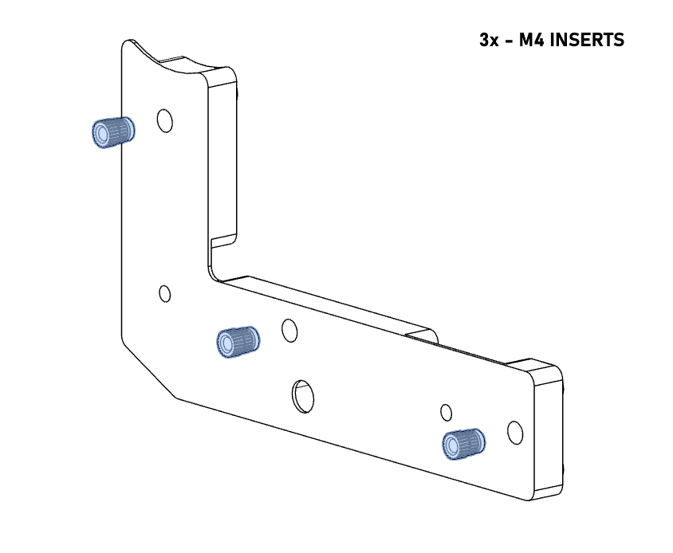

### Tension Arm

### Tensioner Body

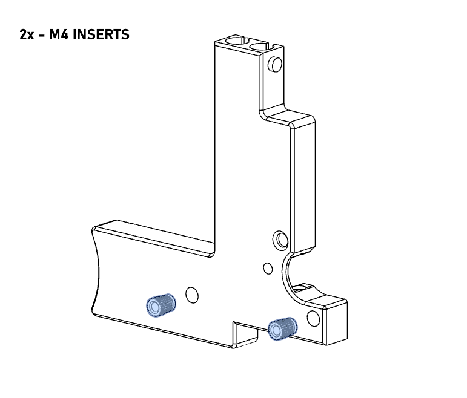

## Magnet Installation

Magnets are used to retain safety covers on the WT-01. All magnets provided are M6x2. While magnets should fit snugly into their recesses, a small drop of super glue will prevent the magnets from working their way out after many cycles of cover installation and removal.

**IMPORTANT.** Ensure all magnets are installed in matching orientation into base parts and covers. This may be simply achieved by first installing the magnets into all covers and subsequently placing another magnet on each installed magnet. The secondary placed magnet may be carefully removed and installed in matching orientation in the base part.

Install magnets in accordance with the following images:

### Front Lower Base

### Back Lower Base

### Tool Mount

### Tensioner Body

### Flushing Cap

### Front Lower Cover

### Back Lower Cover

### Tool Mount Cover

### Tensioner Cover

## Mechanical Assembly

When assembling the WT-01, care must be taken not to cross thread fasteners into the aluminum endoskeleton. If fasteners are cross threaded, the type III anodizing may be damaged, exposing the bare aluminum to water. This will lead to corrosion and premature degradation of your WT-01.

All hardware required for assembly is included with the WT-01 kit from Rack Robotics. Additional 625RS bearings and WC blocks have been provided as these are wear components.

The following hardware is required for assembly of the WT-01:

|Part                                 |Number Required    |
|-------------------------------------|-------------------|
|Endoskeleton                         |         1         |
|Ceramic Wire Guide                   |         1         |
|WC Block                             |         1         |
|625RS Bearing                        |         4         |
|18RPM 24V DC Motor                   |         1         |
|Bowden Coupler                       |         2         |
|Tension Spring                       |         1         |
|M3 Rivnut                            |         1         |
|135mm PTFE Tube                      |         1         |
|Wago 221-412                         |         4         |
|Wago 221-413                         |         1         |
|M3x8 Buttonhead Cap Screw            |         6         |
|M3x16 Countersunk Screw              |         1         |
|M4x16 Countersunk Screw              |         11        |
|M4x25 Buttonhead Cap Screw           |         1         |
|M5x12 Buttonhead Cap Screw           |         1         |
|M6x30 Buttonhead Cap Screw           |         1         |
|M6 Nylock                            |         1         |

## Subcomponents

Mechanical assembly begins with the assembly of subcomponents.

Complete mechanical assembly in accordance with the following images:

### Idler (2x)
Complete this step 2 times.
Requires:
- 625RS Bearing (2x)
- Idler Print (2x)

**ALERT.** While bearing fit may be slightly tight, it is advised to add a small amount of superglue here prior to installation. Apply light coating only on interior walls of Idler print. This will ensure retention through the life of the bearing. Bearings will corrode over time. Extras have been included in the Wire Tool Kit.

### Tension Arm
Requires:
- Tension Arm Print
- 625RS Bearing
- M5x12 Button Head Cap Screw

**ALERT.** Use caution when installing M5x12 BHCS. This screws directly into plastic on the rear side. Install with light force until snug in part. Do not overtighten and strip hole.

### Flushing Cap
Requires:
- Flushing Cap Print
- Ceramic Wire Guide

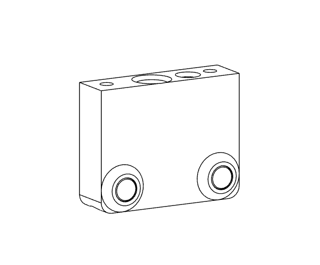
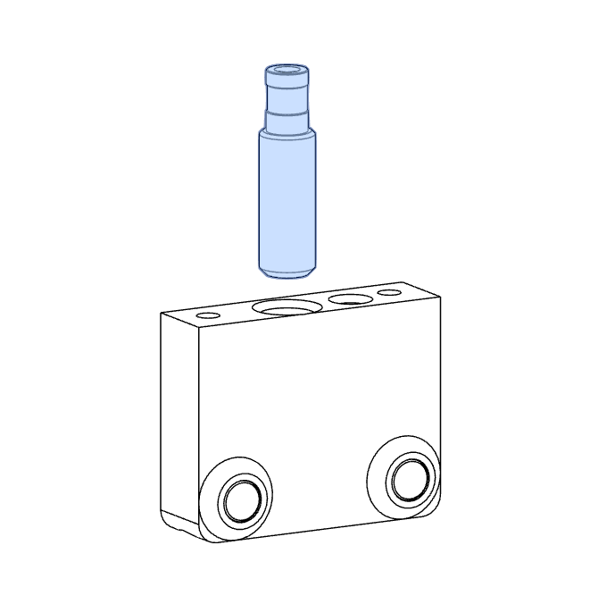

### Tensioner Body
Requires:
- Tensioner Body Print
- Flushing Cap Assembly
- M3x8 Button Head Cap Screw (2x)
- Bowden Coupler (2x)
- PTFE Tube

**NOTE.** Bowden couplers are supplied with gaskets installed. These gaskets are the black plastic and rubber portions. *Remove these prior to installation.* Install blue collar prior to installation.

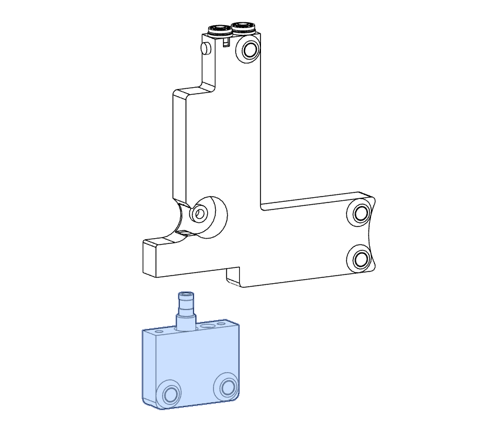

## Final Assembly

Once subcomponents have been assembled, final assembly may begin.

Complete the mechanical assembly of the WT-01 in accordance with the following images:

### Front Lower Base
Requires:
- Endoskeleton
- Front Lower Base Print
- Idler Assembly (2x)
- M4x16 Countersunk Screw (2x)

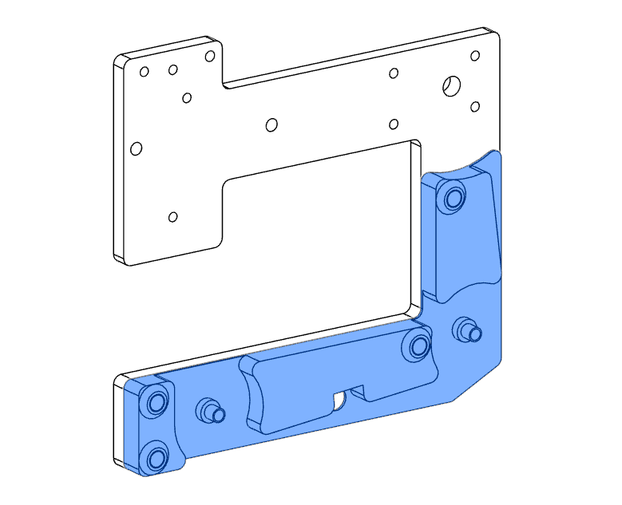

**NOTE.** Printed idler bosses are designed to deform upon installation of M4x16 CS screws. This deformation will provide a more secure location for the idlers. Ensure that screws are tightened enough to deform top portion of idler boss, but not enough to crush base portion and misalign idlers.

When replacing idler bearings, this deformation will prevent removal. Either reprint lower front base for this step or use light application of hot air when removing idlers. Hot air will soften the idler boss enough to remove the idler assembly without needing to reprint base component. 

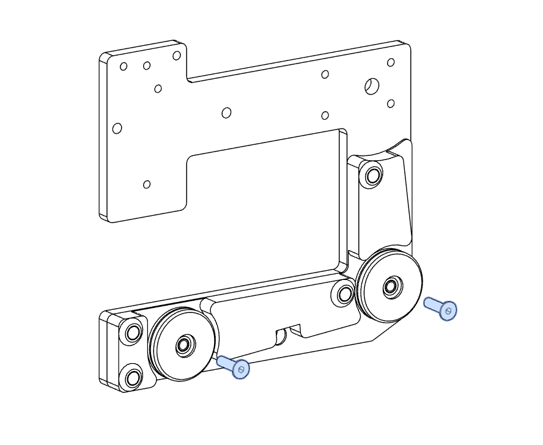

### Back Lower Base
Requires:
- Back Lower Base Print
- M4x16 Countersunk Screw (3x)

### Tensioner Body
Requires:
- Tensioner Assembly
- Tension Arm Assembly
- 625RS Bearing
- Pinch Bearing Boss
- M4x16 Countersunk Screw (2)
- Tension Spring
- M3 Rivnut

**NOTE.** Printed stationary pinch roller boss is designed to deform upon installation of M4x16 CS screw. This deformation will provide a more secure location for the pinch roller.

### Tool Mount
Requires:
- Tool Mount Print
- M4x16 Countersunk Screw (3x)
- Wago 221-412 (4x)
- Wago 221-413

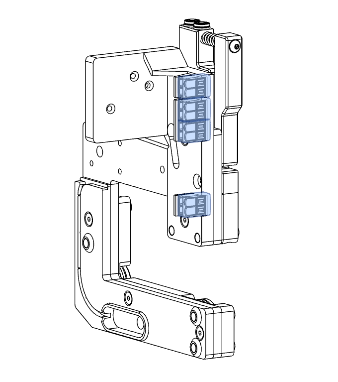

### Spool Motor and Base
Requires:
- Motor Base Print
- Motor Cover Print
- 18RPM DC Motor
- M3x8 Buttonhead Cap Screw (4x)
- M4x16 Countersunk Screw

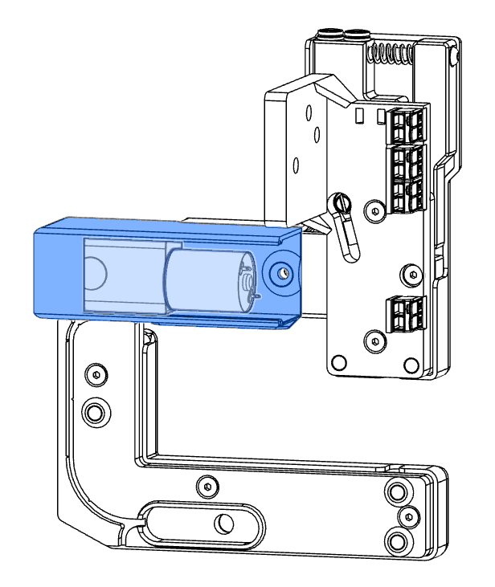

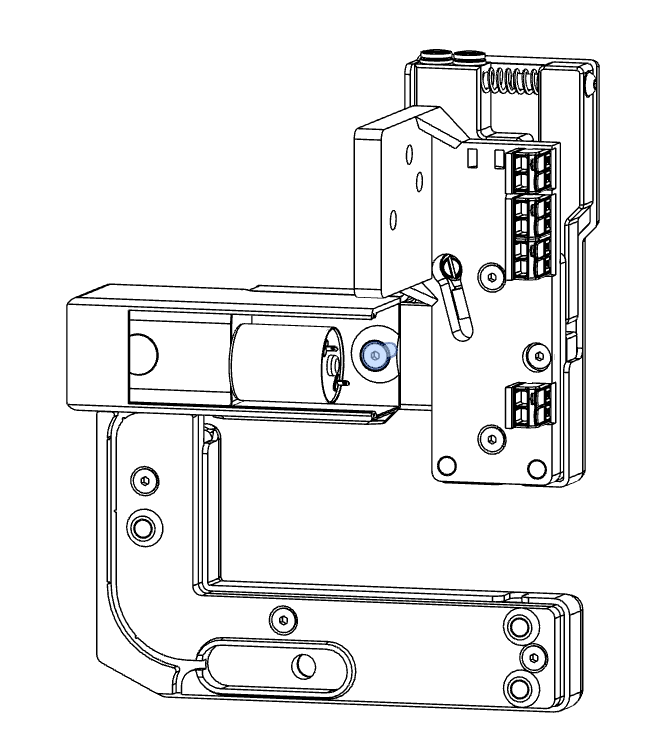

**ALERT.** There is little thread engagement on screws for the following step. This is due to variation in production thickness of endoskeleton. Ensure motor is pressed tight against the endoskeleton during this step. Apply only *light force* when fastening screws. Loctite may be desirable.

### Waste Spool
Requires:
- Waste Spool Print
- M3x16 Countersunk Screw

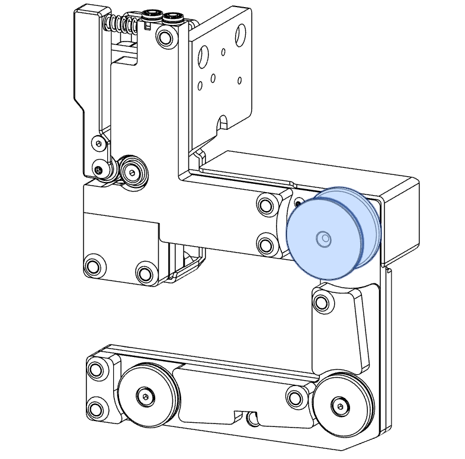

## Wiring
While simple, proper wiring of the WT-01 is critical. Ensure all of the following electrical connections are well secured. 

### WC Block and Cathode Wire

The WC block is the component that connects the cutting wire to the circuit. Ensuring a solid and long term electrical connection is important for reliability and safety. After installation of WC block and cathode wire, potting of the connection with hot glue is strongly recommended. Potting will help to prevent oxidation of the connector, improving lifetime.

After installation and potting, route the cathode wire through the integrated wire run in the lower back base 3D print to the Wago bank on the tool mount print. Fastener cap should be added to the M6 screw for added safety. This may be applied with waterproof adhesive of choice.

Requires:
- WC Block
- Insulating Boss
- M6x30 Button Head Cap Screw
- M6 Nylock
- Cathode Wire

**ALERT.** Please pot the electrical connection at this point. Hot glue will provide some protection against water for this connection. 3D print is designed to act as a potting cup and may be filled completely with glue. Lower temperature plastics like PLA may be damaged by potting entire cavity at once. Several steps may be required, allowing time to cool between each. 

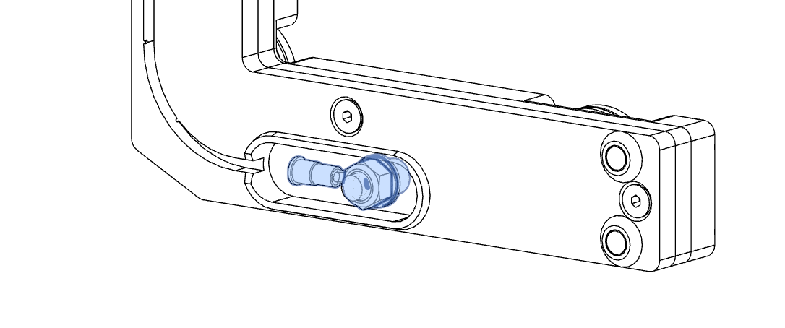

### Ground Wire

The grounding wire is secured with a self tapping screw. This screw cuts into the endoskeleton and grounds it. This is done for safety and EMI reduction.

**ALERT.** Users have reported shearing of the screw head during installation. It is highly recommended to thread this hole manually with an 8-32 tap prior to installation. If unable to tap this hole, it is recommended to use a fastener with a clearly visible cutting tip with recess for chips. Rack Robotics is working on a fix.

Requires:
- Self Tapping Screw
- Ground Wire

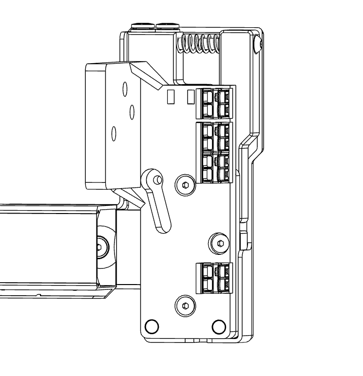

**ALERT.** Users have reported that over torquing the self tapping fastener shears off fastener head. Apply gentle pressure *by hand* when installing this part.

### Power Connections

Wires supplied in the WT-01 kit require stripping before insertion into Wago terminals. Wires have been provided in this fashion in order to prevent fraying and damage during shipping. **IMPORTANT. Strip all wires to expose 11mm of conductor.**

First, complete wiring to the Vat. Complete wiring in accordance with the following images:

**IMPORTANT. DO NOT TWIST WIRES PRIOR TO INSERTION INTO WAGO SLOTS.**

After completion of wiring for the Vat, the tool must next be wired.

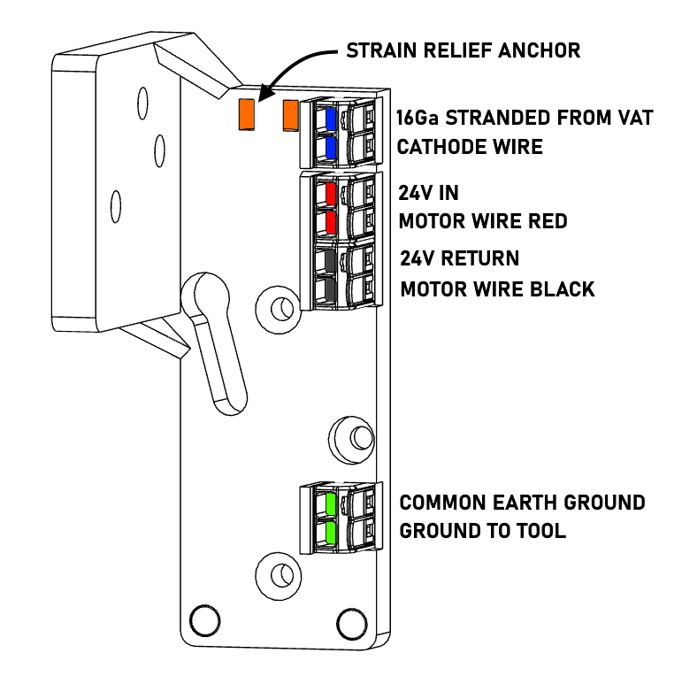

After completion of wiring, consolidation of wiring loom with zip ties is recommended. 

### Magnetic Covers

Now that final assembly and wiring have been completed, magnetic covers may be installed.

## Mounting

Mounting the WT-01 in its base configuration on the Ender 3 is a simple task. The steps for doing so are as follows:
- Remove Ender 3 hotend, retaining mounting hardware
- Place WT-01 on hotend mounting boss
- Reinstall hotend mounting fasteners through holes in the WT-01 Tool Mount Plate

## Threading of Wire

Threading is the act of guiding the brass EDM wire through the wire EDM tool. Here are a few tips for threading the wire tool: 

- Use a lighter to part the brass EDM wire, DO NOT cut it with a clipper or knife. Clipping or cutting of the wire leaves a burr on the wire, which prevents it from entering the ceramic wire guide. Burrs can be avoided by placing the EDM wire into the flame of a lighter, and applying tension by hand. The heat melts the wire, and allows it to be drawn into a sharp point. This sharp point permits the brass EDM wire to enter the precision wire guide. 
- Release tension on the system by loosening tension spring completely; then depress the tension arm and manually feed the wire through the PTFE tube and wire guide.
- Guide wire around the first and second idler, taking care to ensure that the wire sits below the WC block.
- Thread the wire through the hole in the waste spool. Pull tight and hold the wire out to the side near the the waste spool's axis of rotation.
- Re-apply tension by tightening the screw on the tension arm.
- Turn on the spool motor and allow at least 5 full turns before letting go of wire.
- Excess wire used for threading may now be broken off of the waste spool.
- WT-01 is now threaded and ready to cut.

## Integrating Flushing

The wire tool supports dielectric flushing. Flushing dramatically improves cutting reliability and cutting speed. Dielectric (distilled water or EDM oil) removes EDM chips from the cut and cools the wire. Most problems in wire EDM are solved by adding more dielectric flushing. It is recommended to use a 100 PSI water pump with the Wire Tool.

## Troubleshooting

(TO BE ADDED)

## Drawings

## Contributing

Want to chat? Please join our [discord](https://discord.gg/z4XNk7Hkgw). 
